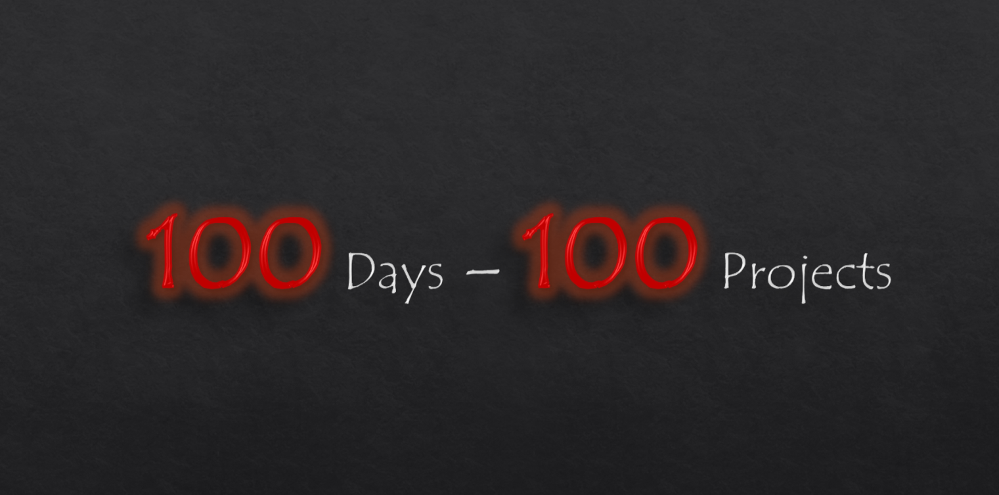

    <h1>100 Days - 100 Projects</h1>

   
    

 

    <h3>HTML CSS and JS</h3>

    
We’re thrilled to launch our 100 Days, 100 Projects challenge, where we’ll embark on an incredible journey to enhance our HTML, CSS, and JavaScript skills together!

What’s the Challenge? Over the next 100 days, each of us will create a new project every day, ranging from simple to complex. This is a fantastic opportunity to learn, experiment, and showcase your creativity!

# How It Works?

- **Daily Updates:** I will be documenting each project in this repository, including a brief description, the technologies used, and the lessons learned.

- **Project Variety:** Projects will range from simple static pages to interactive applications. 

**Here are some examples of what I plan to create:**

- Personal portfolio website
To-do list app
Weather dashboard using an API
Interactive game
Responsive layouts and animations

 

# Why 100 Projects?

- **Skill Development:** Creating a variety of projects will help me solidify my understanding of web technologies and improve my coding skills.

- **Portfolio Building:** By the end of this challenge, I will have a diverse portfolio of projects that demonstrate my growth and capabilities as a developer.

- **Consistency & Discipline:** Committing to a daily project will help instill a routine of continuous learning and creativity.

 

# What to Expect:

- **Daily Updates:**
Each day, I will document my progress in this repository. Each project will include:

A brief description of the project and its purpose
The technologies and tools used
Screenshots or live demos (when applicable)
Insights and lessons learned throughout the process
Project Variety:
I aim to cover a broad range of topics and techniques. Here are some examples of the types of projects I plan to create:

- **Personal Portfolio Website:** A showcase of my skills and projects.
Interactive To-Do List App: A practical application to manage tasks.
Weather Dashboard: Utilizing an API to fetch and display weather data.

- **Game Development:** Creating a simple browser-based game.
Responsive Layouts: Exploring CSS Grid and Flexbox to design adaptable interfaces.
Data Visualization: Using JavaScript libraries to visualize data in engaging ways.
And much more!

 

# Kick-off Date

<h3>Starting from:</h3>

`Saturday, October 26, 2024`

<h3>Ends:</h3>

`Monday, February 3, 2025`

# GPL-3.0 LICENSE

[GPL-3.0 LICENSE](LICENSE.md)